## Part 1. Установка ОС
1. Установил Ubuntu 20.04 Server LTS. Проверяю версию.

	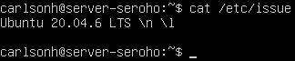 \
	*Вывод команды `cat /etc/issue` с версией Ubuntu.*

## Part 2. Создание пользователя

1. Создаю нового пользователя. \
	 \
	*Создание нового пользователя.*

2. Добавляю нового пользователя в группу adm. \
	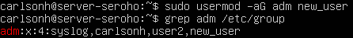 \
	*Добавление пользователя в группу adm.*

3. Просматриваю список пользователей \
	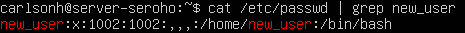 \
	*Вывод команды `cat /etc/passwd`.*

## Part 3. Настройка сети ОС

1. Задаю название машины вида user-1. \
	```sudo hostnamectl set-hostname user-1```

2. Устанавливаю временную зону.  
	1. Узнаю название нашей временной зоны: \
	```sudo timedatectl list-timezones | grep Novosibirsk```
	2. Устанавливаю временную зону и проверяю, что все корректно установилось. \
  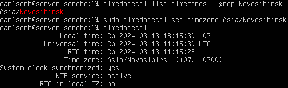 \
	*Установка time-zone.*

3. Просматриваю список сетевых интерфейсов:
   1. ```ifconfig``` \
  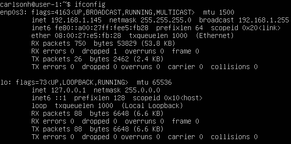 \
  *Вывод списка сетевых интерфейсов.*
   1. Если нужно вывести только имена, то можем модифицировать команду. С помощью утилиты grep вывести только имена: \
  ```ifconfig | grep -o '^[a-zA-Z][^:]*'``` \
  Данное регулярное выражение ищет строки, в которых начало идет с буквы и ищет до тех пор, пока не встретит двоеточие.

- lo - это виртуальный интерфейс, присутствующий по умолчанию в любом Linux. Он используется для отладки сетевых программ и запуска серверных приложений на локальной машине. С этим интерфейсом всегда связан адрес 127.0.0.1. У него есть dns-имя – localhost.

4. Получаю ip адрес от dhcp сервера: \
  ```sudo dhclient -v``` \
   \
	*Получение ip.*
- DHCP (Dynamic Host Configuration Protocol) - это сетевой протокол, который позволяет компьютерам автоматически получать IP-адреса и другие параметры сетевой конфигурации от DHCP сервера в сети.

5. Определяю внешний IP адрес шлюза: \
  ```wget -O - -q icanhazip.com``` \
  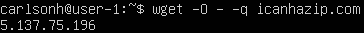 \
	*Внешний IP адрес шлюза.*

6. Определяю внутренний IP адрес шлюза: \
  ```route -n``` \
  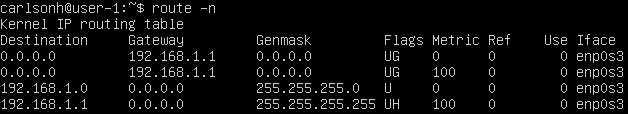 \
	*Внутренний IP адрес шлюза.*

7. Задаю статичные ip, gateway и dns, изменяя файл конфигурации интерфейса:  
  ```sudo nano /etc/netplan/00-installer-config.yaml``` \
   \
	*Дефолтная конфигурация.* 

	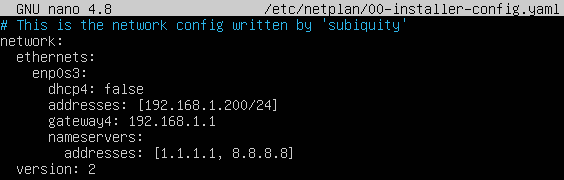 \
	*Измененная конфигурация.* 

	Применяю изменения: \
	```sudo netplan apply``` \
	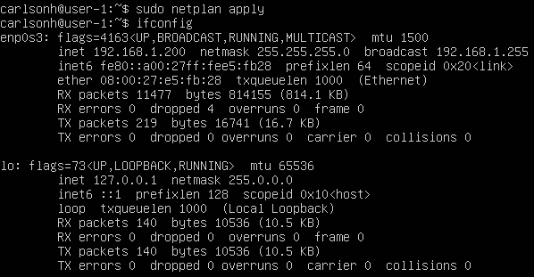 \
	*Проверка IP адреса после внесенных изменений.*

	Перезагружаю машину командой ```sudo reboot``` и пингую сервера. \
	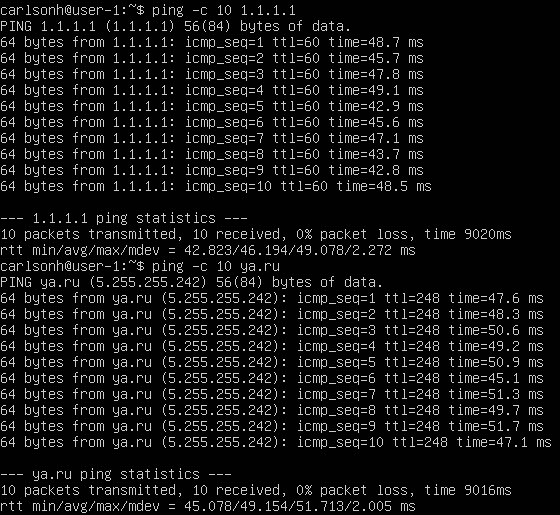 \
	*Пингование серверов.* 

## Part 4. Обновление ОС

1. Обновляю систему. \
  ```sudo apt update``` \
  ```sudo apt upgrade```

2. Попытка повторного обновления: \
	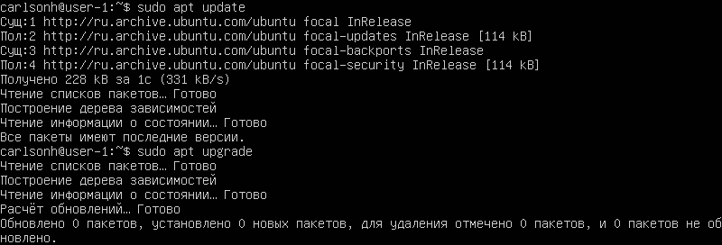 \
	*Попытка повторного обновления.* 

## Part 5. Использование команды **sudo**

- Команда sudo в Linux предоставляет временные привилегии суперпользователя (root) для выполнения определенных команд. Она позволяет обычным пользователям выполнить команды, требующие административных прав, после ввода своего пароля. Это безопасный способ управления системой, предотвращающий случайное изменение или удаление важных файлов системы.

1. Добавляю пользователя созданного в пункте 2, в группу sudo. \
  ```sudo usermod -aG sudo new_user``` \
  Эта команда позволит этому пользователю использовать команду sudo.

2. Меняю hostname от лица new_user: \
	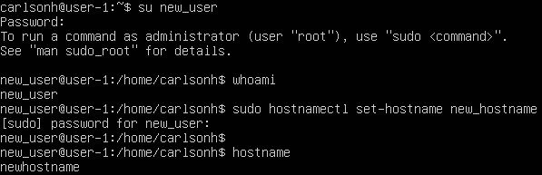 \
	*Смена hostname.* 

## Part 6. Установка и настройка службы времени

1. Включаю службу автоматической синхронизации времени: \
  ```sudo timedatectl set-ntp true```

2. Проверяю синхронизацию и часовой пояс: \
  ```timedatectl show``` \
	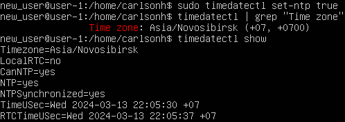 \
	*Вывод команды timedatectl show.* 

## Part 7. Установка и использование текстовых редакторов 

1. Vim. Cоздание файла и сохранение ника
  - ```sudo vim test_vim.txt``` \
   \
	*Vim перед выходом*
  - Сохраняю изменения сочетанием ```ctrl + o```
  - Выхожу из редактора сочетанием ```ctrl + x```
2. Vim. Редактирование без сохранения 
  - Открываю файл командой из первого пункта.
  - Включаю режим редактирования кнопкой insert.
  - Меняю ник на 21 School 21.
  - Нажимаю ```esc``` и вводим ```q!```, для выхода без сохранения.
  - Проверяю содержимое файла после выхода: \
  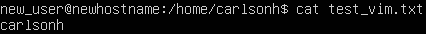 \
	  *Vim после выхода без сохранения*
3. Vim. Поиск слова.
  - Захожу в файл.
  - Нажимаю ```esc```, ввожу команду в формате ```:s/искомое_слово``` \
   \
	  *Vim, поиск слова*
4. Vim. Замена слова.
  - Использую команду ```:s/искомое_слово/слово_для_замены/g```
  - Проверяю файл после замены: \
  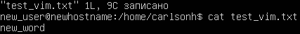 \
	  *Vim, после замены слова*

5. Nano. Cоздание файла и сохранение ника.
  - ```sudo nano test_vim.txt``` \
     \
	  *Nano перед выходом*
6. Nano. Редактирование без сохранения.
  - Захожу в файл.
  - Редактирую текст
  - Нажимаю ```ctrl + x``` и ввожу *n*. Чтобы не сохранять изменения. \
   \
	  *Nano после выхода без сохранения*
7. Nano. Поиск слова.
  - Для поиска слова нужно нажать ```ctrl + w``` и ввожу искомое слово. \
  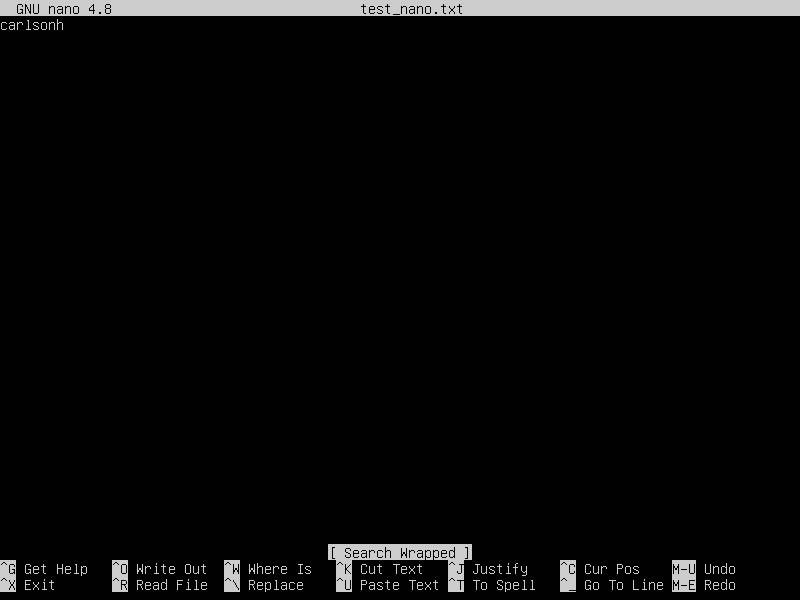 \
	  *Nano. Поиск слова.*
8. Nano. Замена слова.
  - Для замены слова нажимаю ```ctrl + \```
  - Ввожу искомое, далее на которое заменить и сохраняю нажатием на *y*. \
  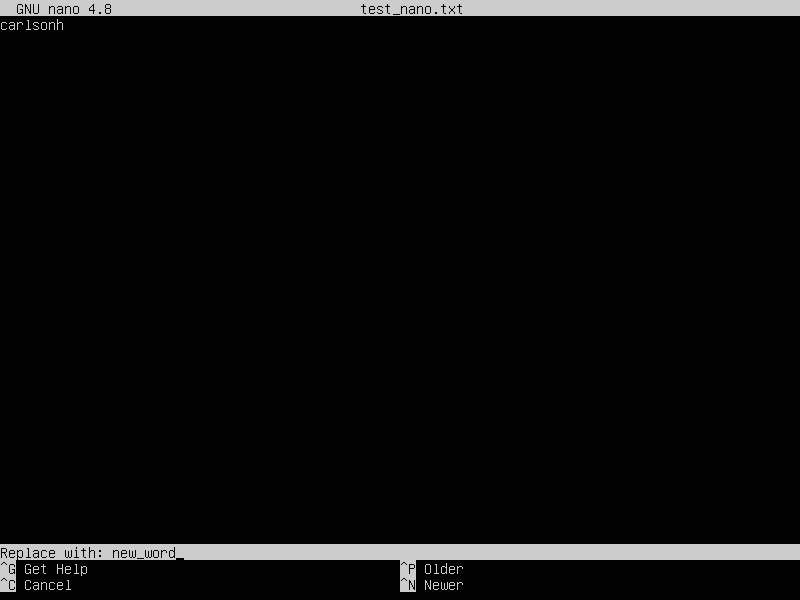 \
	  *Nano. Замена слова.*
   
9. MCEDIT. Cоздание файла и сохранение ника.
  - ```sudo mcedit test_mcedit.txt``` \
    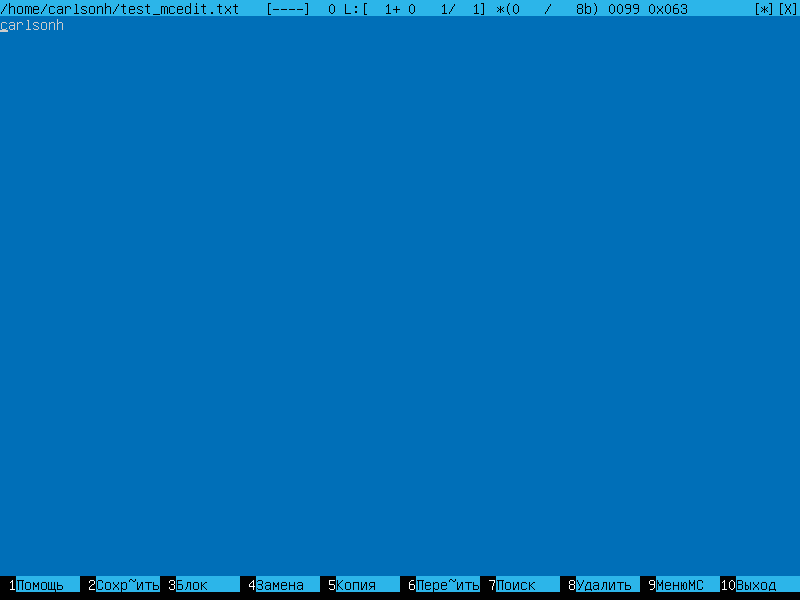 \
	  *test_mcedit перед выходом*
10. MCEDIT. Редактирование без сохранения.
  - Нажимаю ```f10``` для сохранения и выбираю *нет*. \
   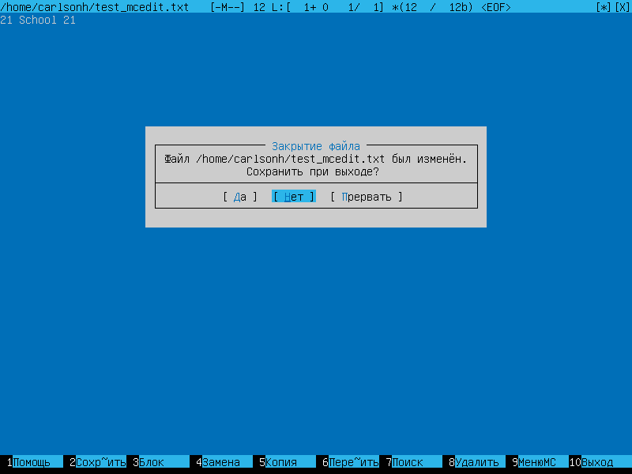 \
	  *mcedit после выхода без сохранения*
11. MCEDIT. Поиск слова.
  - Нажимаю ```f7``` и ввожу искомое слово \
  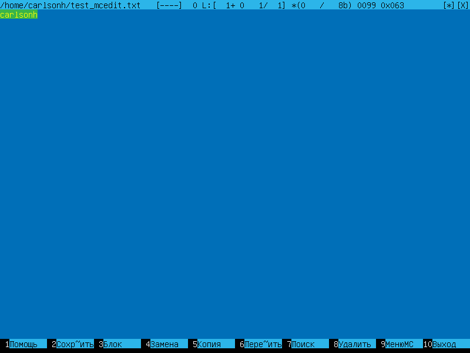 \
	  *mcedit. Поиск слова.*
12. MCEDIT. Замена слова.
  - Нажимаю ```f4``` ввожу искомое слово и слово для замены.
  - Заменяю и подтверждаю. \
  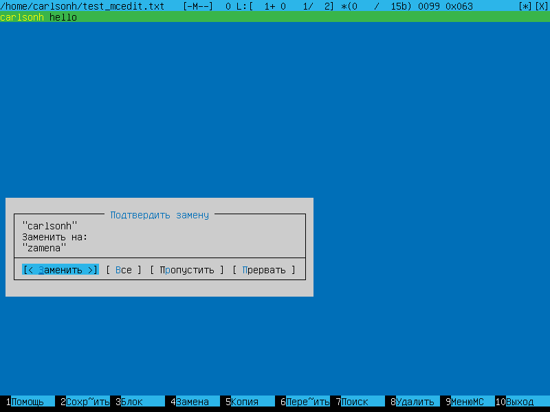 \
  *MCEDIT. Замена слова.*

## Part 8. Установка и базовая настройка сервиса **SSHD**

1. Установил sshd. ```sudo apt-get install sshd```.
2. Добавил автостарт службы ```sudo systemctl enable ssh```.
3. Зашел в файл конфигурации sshd. Раскоменитировал строку порт и изменил значение. \
```sudo nano /etc/ssh/sshd_config```
4. Ввел команду ```ps -ef | grep sshd```.
   - ключ e - отображает все процессы
   - ключ f - полный формат вывода
5. Перезагрузил систему ```sudo reboot```.
6. Вывод команды ```netstat -tan```: \
  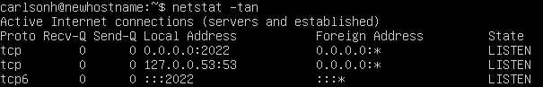 \
  *Netstat вывод.*
7. netstat -tan выводит список всех TCP соединений на системе. Здесь: \
   - t: Показать только TCP соединения.
   - a: Показать все соединения и порты, как слушающие, так и установленные.
   - n: Показать числовые адреса и порты, а не их имена.
   - В выводе команды netstat -tan значение 0.0.0.0:2022 указывает на то, что SSHd слушает на порту 2022 на всех интерфейсах.
8. Когда вы выполняете команду netstat -tan, вы получаете список всех TCP-соединений на вашей системе, а также соответствующих адресов и портов. Вот что означает каждый столбец:
    | column name     | description |
    | --------------- | ----------- |
    | Proto           | Этот столбец показывает протокол, используемый для соединения. |
    | Recv-Q          | Этот столбец показывает размер очереди входящих данных (в байтах) для этого соединения. Если он показывает 0, это означает, что очередь входящих данных пуста. |
    | Send-Q          | Этот столбец показывает размер очереди исходящих данных (в байтах) для этого соединения. Если он показывает 0, это означает, что очередь исходящих данных пуста. |
    | Local Address   | Этот столбец показывает локальный IP-адрес и порт машины. |
    | Foreign Address | Этот столбец показывает внешний IP-адрес и порт удаленного хоста, с которым установлено соединение. |
    | State           | Этот столбец показывает текущее состояние соединения, такое как ESTABLISHED (установлено), LISTEN (слушается), CLOSE_WAIT (ожидает закрытия), и т. д |


## Part 9. Установка и использование утилит **top**, **htop**

1. Запуск утилиты top: \
  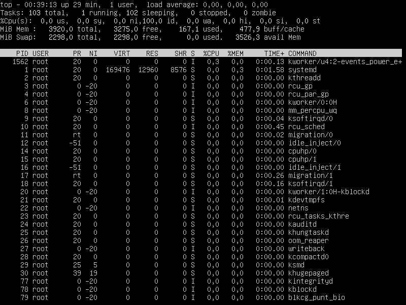 \
  *Top вывод.*

2. Опеределение характеристик:
  - uptime - 39 min
  - количество авторизованных пользователей - 1
  - общую загрузку системы (load avarage) - 0.00, 0.00, 0.00
  - общее количество процессов (Tasks) - 103 total, 1 running, 102 sleeping, 0 stopped, 0 zombie
  - загрузка cpu - 0,0 us, 0,0 su, 0,0 ni, 100,0 id, 0,0 wa, 0,0 hi, 0,0 si, 0,0 st
  - загрузка памяти (Mib Mem) - 3920,0 total, 3275,0 free, 167,1 used, 477,9 buff/cache
  - pid процесса занимающего больше всего памяти - 1310
  - pid процесса, занимающего больше всего процессорного времени - 1562
  
3. Выводы htop.
  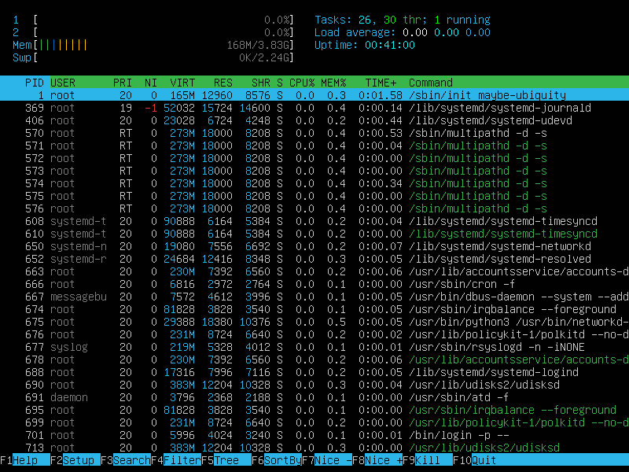 \
  *Htop вывод. PID сортировка.* \
  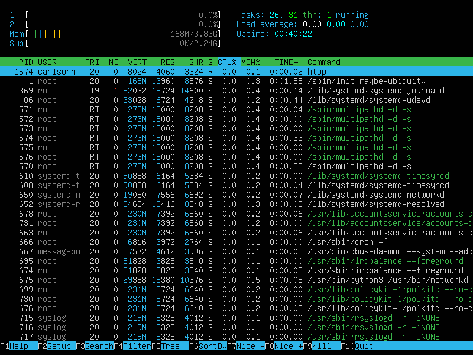 \
  *Htop вывод. PERCENT_CPU сортировка.* \
  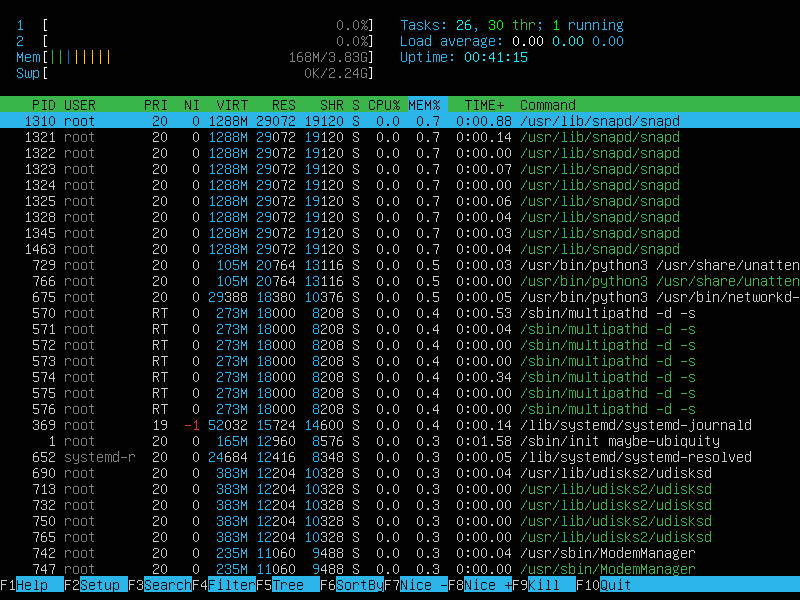 \
  *Htop вывод. PERCENT_MEM сортировка.* \
  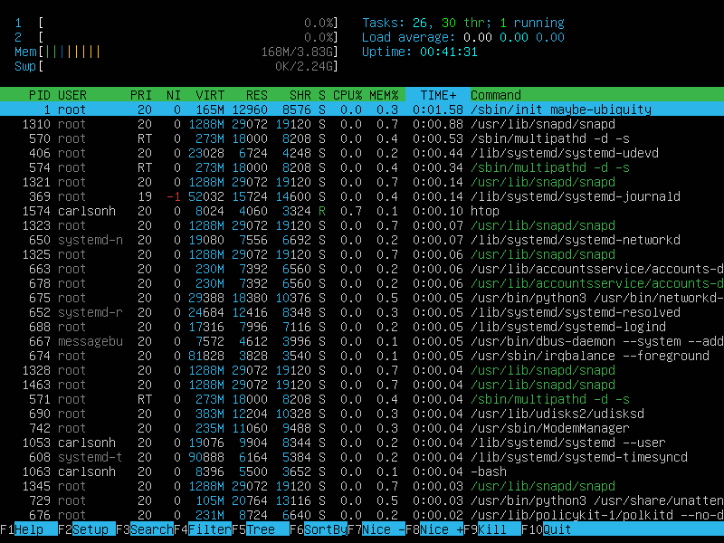 \
  *Htop вывод. Time.* \
  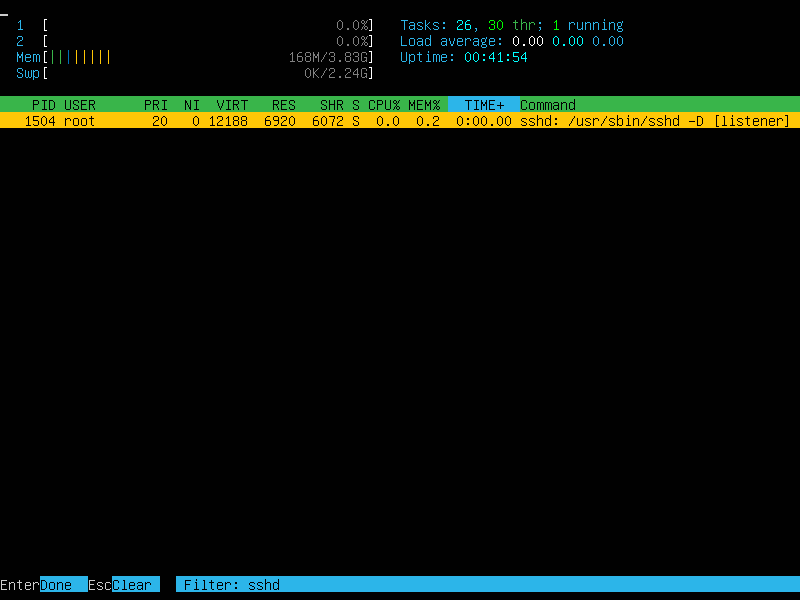 \
  *Htop вывод. SSHD.* \
  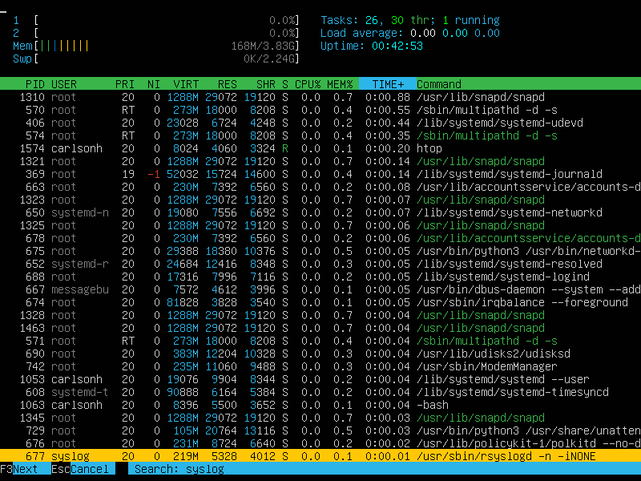 \
  *Htop вывод. Syslog.* \
  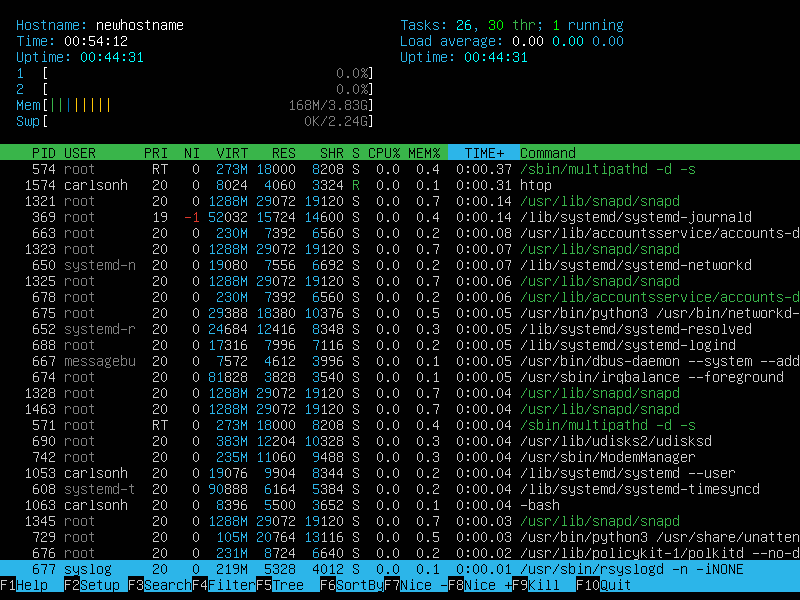 \
  *Htop вывод с добавленным выводом hostname, clock и uptime.* 

## Part 10. Использование утилиты **fdisk**

1. Запускаю утилиту ```sudo fdisk -l``` \
    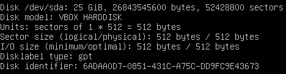 \
  *Вывод fdisk -l* \
  Также необходимо получить размер swap. Использую команду ```free -h``` \
    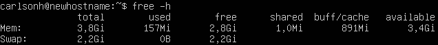 \
  *Вывод free -h* 

    | Name of disk | Size | Number of sectors | Swap size |
    | ------------ | ---- | ----------------- | --------- |
    | /dev/sda | 25 GiB | 52428800 | 2,2Gi |

## Part 11. Использование утилиты **df** 

1. Запускаю утилиту ```sudo df``` \
    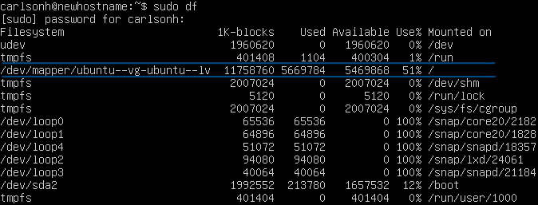 \
  *Вывод df*
  - размер раздела: 11758760
  - размер занятого пространства: 5669784
  - размер свободного пространства: 5469868
  - процент использования: 51%
  - единица измерения в выводе: килобайты

1. Запускаю утилиту ```sudo df -Th``` \
    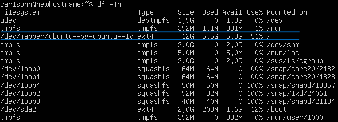 \
  *Вывод df -Th*
  - размер раздела: 12G
  - размер занятого пространства: 5,5G
  - размер свободного пространства: 5,3G
  - процент использования: 51%
  - тип файловой системы для раздела: ext4

## Part 12. Использование утилиты **du**

`-` df - не единственный способ получить информацию о дисковом пространстве. Сейчас расскажу про ещё один.

**== Задание ==**

##### Запусти команду du
##### Выведи размер папок /home, /var, /var/log (в байтах, в человекочитаемом виде)
##### Выведи размер всего содержимого в /var/log (не общее, а каждого вложенного элемента, используя *)

- В отчёт вставь скрины с выводом всех использованных команд.

## Part 13. Установка и использование утилиты **ncdu**

`-` Тебе, возможно, не очень понравился формат, в котором команда du выводит информацию. Я тебя прекрасно понимаю. Поэтому сейчас мы рассмотрим её улучшенную версию.

**== Задание ==**

##### Установи утилиту ncdu
##### Выведи размер папок /home, /var, /var/log

- Размеры должны примерно совпадать с полученными в [Part 12](#part-12-использование-утилиты-du).

- В отчёт вставь скрины с выводом использованных команд.

## Part 14. Работа с системными журналами

`-` Системному администратору иногда приходится просматривать события, происходившие в системе в недавнем прошлом. Для этого в Linux есть системные журналы.

**== Задание ==**

##### Открой для просмотра:
##### 1. /var/log/dmesg
##### 2. /var/log/syslog
##### 3. /var/log/auth.log  

- Напиши в отчёте время последней успешной авторизации, имя пользователя и метод входа в систему;
- Перезапусти службу SSHd;
- Вставь в отчёт скрин с сообщением о рестарте службы (искать в логах).

## Part 15. Использование планировщика заданий **CRON**

`-` Фух, наконец-то мы добрались до последней части моего долгого повествования. Сейчас я покажу программу, которая, помимо прочего, заметно упрощает периодический вызов других программ.

**== Задание ==**

##### Используя планировщик заданий, запусти команду uptime через каждые 2 минуты.
- Найди в системных журналах строчки (минимум две в заданном временном диапазоне) о выполнении;
- Выведи на экран список текущих заданий для CRON;
- Вставь в отчёт скрины со строчками о выполнении и списком текущих задач.

##### Удали все задания из планировщика заданий.
- В отчёт вставь скрин со списком текущих заданий для CRON.