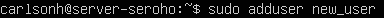
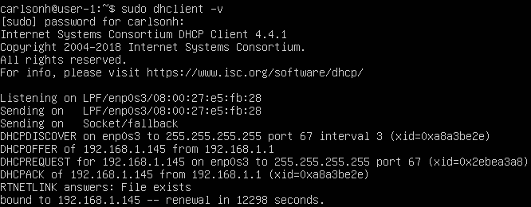
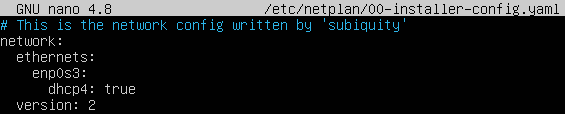

## Part 1. Установка ОС
1. Установил Ubuntu 20.04 Server LTS. Проверяю версию.

	 \
	*Вывод команды `cat /etc/issue` с версией Ubuntu.*

## Part 2. Создание пользователя

1. Создаю нового пользователя. \
	 \
	*Создание нового пользователя.*

2. Добавляю нового пользователя в группу adm. \
	 \
	*Добавление пользователя в группу adm.*

3. Просматриваю список пользователей \
	 \
	*Вывод команды `cat /etc/passwd`.*

## Part 3. Настройка сети ОС

1. Задаю название машины вида user-1. \
	```sudo hostnamectl set-hostname user-1```

2. Устанавливаю временную зону.  
	1. Узнаю название нашей временной зоны: \
	```sudo timedatectl list-timezones | grep Novosibirsk```
	2. Устанавливаю временную зону и проверяю, что все корректно установилось. \
   \
	*Установка time-zone.*

3. Просматриваю список сетевых интерфейсов:
   1. ```ifconfig``` \
   \
  *Вывод списка сетевых интерфейсов.*
   1. Если нужно вывести только имена, то можем модифицировать команду. С помощью утилиты grep вывести только имена: \
  ```ifconfig | grep -o '^[a-zA-Z][^:]*'``` \
  Данное регулярное выражение ищет строки, в которых начало идет с буквы и ищет до тех пор, пока не встретит двоеточие.

- lo - это виртуальный интерфейс, присутствующий по умолчанию в любом Linux. Он используется для отладки сетевых программ и запуска серверных приложений на локальной машине. С этим интерфейсом всегда связан адрес 127.0.0.1. У него есть dns-имя – localhost.

4. Получаю ip адрес от dhcp сервера: \
  ```sudo dhclient -v``` \
   \
	*Получение ip.*
- DHCP (Dynamic Host Configuration Protocol) - это сетевой протокол, который позволяет компьютерам автоматически получать IP-адреса и другие параметры сетевой конфигурации от DHCP сервера в сети.

5. Определяю внешний IP адрес шлюза: \
  ```wget -O - -q icanhazip.com``` \
   \
	*Внешний IP адрес шлюза.*

6. Определяю внутренний IP адрес шлюза: \
  ```route -n``` \
   \
	*Внутренний IP адрес шлюза.*

7. Задаю статичные ip, gateway и dns, изменяя файл конфигурации интерфейса:  
  ```sudo nano /etc/netplan/00-installer-config.yaml``` \
   \
	*Дефолтная конфигурация.* 

	 \
	*Измененная конфигурация.* 

	Применяю изменения: \
	```sudo netplan apply``` \
	 \
	*Проверка IP адреса после внесенных изменений.*

	Перезагружаю машину командой ```sudo reboot``` и пингую сервера. \
	 \
	*Пингование серверов.* 

## Part 4. Обновление ОС

1. Обновляю систему. \
  ```sudo apt update``` \
  ```sudo apt upgrade```

2. Попытка повторного обновления: \
	 \
	*Попытка повторного обновления.* 

## Part 5. Использование команды **sudo**

- Команда sudo в Linux предоставляет временные привилегии суперпользователя (root) для выполнения определенных команд. Она позволяет обычным пользователям выполнить команды, требующие административных прав, после ввода своего пароля. Это безопасный способ управления системой, предотвращающий случайное изменение или удаление важных файлов системы.

1. Добавляю пользователя созданного в пункте 2, в группу sudo. \
  ```sudo usermod -aG sudo new_user``` \
  Эта команда позволит этому пользователю использовать команду sudo.

2. Меняю hostname от лица new_user: \
	 \
	*Смена hostname.* 

## Part 6. Установка и настройка службы времени

1. Включаю службу автоматической синхронизации времени: \
  ```sudo timedatectl set-ntp true```

2. Проверяю синхронизацию и часовой пояс: \
  ```timedatectl show``` \
	 \
	*Вывод команды timedatectl show.* 

## Part 7. Установка и использование текстовых редакторов 

`-` Думаю, мы готовы перейти к одному из самых страшных этапов. 

На висящей на стене карте мира ты указываешь в сторону Нидерландов:

`-` Здесь Брам Моленар разгадал тайны гармонии и внутренней концентрации. \
Именно здесь 2 ноября 1991 года вышла первая версия VIM. \
Ты хочешь научиться работать в VIM?

`-` Да.

`-` Тогда я и есть твой мастер.

`-` Хорошо...

`-` Только не плачь.

`-` Ладно...

**== Задание ==**

##### Установи текстовые редакторы **VIM** (+ любые два по желанию **NANO**, **MCEDIT**, **JOE** и т.д.)  
##### Используя каждый из трех выбранных редакторов, создай файл *test_X.txt*, где X -- название редактора, в котором создан файл. Напиши в нём свой никнейм, закрой файл с сохранением изменений.  
- В отчёт вставь скриншоты:
  - Из каждого редактора с содержимым файла перед закрытием;
- В отчёте укажи, что сделал для выхода с сохранением изменений.
##### Используя каждый из трех выбранных редакторов, открой файл на редактирование, отредактируй файл, заменив никнейм на строку «21 School 21», закрой файл без сохранения изменений.
- В отчёт вставь скриншоты:
    - Из каждого редактора с содержимым файла после редактирования;
- В отчёте укажи, что сделал для выхода без сохранения изменений.
##### Используя каждый из трех выбранных редакторов, отредактируй файл ещё раз (по аналогии с предыдущим пунктом), а затем освой функции поиска по содержимому файла (слово) и замены слова на любое другое.
- В отчёт вставь скриншоты:
    - Из каждого редактора с результатами поиска слова;
    - Из каждого редактора с командами, введёнными для замены слова на другое.

## Part 8. Установка и базовая настройка сервиса **SSHD**

`-` Удобно иметь доступ от одного компьютера к другому по сети, правда? Но чтобы это было не только удобно, но и безопасно, стоит использовать сервис SSH.

**== Задание ==**

##### Установи службу SSHd.  
##### Добавь автостарт службы при загрузке системы.  
##### Перенастрой службу SSHd на порт 2022.  
##### Используя команду ps, покажи наличие процесса sshd. Для этого к команде нужно подобрать ключи.
- В отчёте объясни значение команды и каждого ключа в ней.
##### Перезагрузи систему.
- В отчёте опиши, что сделал для выполнения всех пяти пунктов (можно как текстом, так и скриншотами).
- Вывод команды netstat -tan должен содержать  \
`tcp 0 0 0.0.0.0:2022 0.0.0.0:* LISTEN`  \
(если команды netstat нет, то ее нужно установить)
- Скрин с выводом команды вставь в отчёт.
- В отчёте объясни значение ключей -tan, значение каждого столбца вывода, значение 0.0.0.0.

## Part 9. Установка и использование утилит **top**, **htop**

`-` Если бы меня спросили, что полезного делают утилиты **top** и **htop**, я бы ответил одним словом - всё.

**== Задание ==**

##### Установи и запусти утилиты top и htop.  

- По выводу команды top определи и напиши в отчёте:
  - uptime
  - количество авторизованных пользователей
  - общую загрузку системы
  - общее количество процессов
  - загрузку cpu
  - загрузку памяти
  - pid процесса занимающего больше всего памяти
  - pid процесса, занимающего больше всего процессорного времени
- В отчёт вставь скрин с выводом команды htop:
  - отсортированному по PID, PERCENT_CPU, PERCENT_MEM, TIME
  - отфильтрованному для процесса sshd
  - с процессом syslog, найденным, используя поиск 
  - с добавленным выводом hostname, clock и uptime  

## Part 10. Использование утилиты **fdisk**

`-` Теперь давай разберёмся, как получить информацию о жёстком диске. Специально для тебя я собрал пару примеров работы с утилитой fdisk.

**== Задание ==**

##### Запусти команду fdisk -l.

- В отчёте напиши название жесткого диска, его размер и количество секторов, а также размер swap.

## Part 11. Использование утилиты **df** 

`-` Информацию о жёстком диске мы получили, но, зачастую, куда интереснее информация о дисковом пространстве, которую можно получить с помощью утилиты df.

**== Задание ==**

##### Запусти команду df.  
- В отчёте напиши для корневого раздела (/):
  - размер раздела
  - размер занятого пространства
  - размер свободного пространства
  - процент использования
- Определи и напиши в отчёт единицу измерения в выводе.  

##### Запусти команду df -Th.
- В отчёте напиши для корневого раздела (/):
    - размер раздела
    - размер занятого пространства
    - размер свободного пространства
    - процент использования
- Определи и напиши в отчёт тип файловой системы для раздела.

## Part 12. Использование утилиты **du**

`-` df - не единственный способ получить информацию о дисковом пространстве. Сейчас расскажу про ещё один.

**== Задание ==**

##### Запусти команду du
##### Выведи размер папок /home, /var, /var/log (в байтах, в человекочитаемом виде)
##### Выведи размер всего содержимого в /var/log (не общее, а каждого вложенного элемента, используя *)

- В отчёт вставь скрины с выводом всех использованных команд.

## Part 13. Установка и использование утилиты **ncdu**

`-` Тебе, возможно, не очень понравился формат, в котором команда du выводит информацию. Я тебя прекрасно понимаю. Поэтому сейчас мы рассмотрим её улучшенную версию.

**== Задание ==**

##### Установи утилиту ncdu
##### Выведи размер папок /home, /var, /var/log

- Размеры должны примерно совпадать с полученными в [Part 12](#part-12-использование-утилиты-du).

- В отчёт вставь скрины с выводом использованных команд.

## Part 14. Работа с системными журналами

`-` Системному администратору иногда приходится просматривать события, происходившие в системе в недавнем прошлом. Для этого в Linux есть системные журналы.

**== Задание ==**

##### Открой для просмотра:
##### 1. /var/log/dmesg
##### 2. /var/log/syslog
##### 3. /var/log/auth.log  

- Напиши в отчёте время последней успешной авторизации, имя пользователя и метод входа в систему;
- Перезапусти службу SSHd;
- Вставь в отчёт скрин с сообщением о рестарте службы (искать в логах).

## Part 15. Использование планировщика заданий **CRON**

`-` Фух, наконец-то мы добрались до последней части моего долгого повествования. Сейчас я покажу программу, которая, помимо прочего, заметно упрощает периодический вызов других программ.

**== Задание ==**

##### Используя планировщик заданий, запусти команду uptime через каждые 2 минуты.
- Найди в системных журналах строчки (минимум две в заданном временном диапазоне) о выполнении;
- Выведи на экран список текущих заданий для CRON;
- Вставь в отчёт скрины со строчками о выполнении и списком текущих задач.

##### Удали все задания из планировщика заданий.
- В отчёт вставь скрин со списком текущих заданий для CRON.